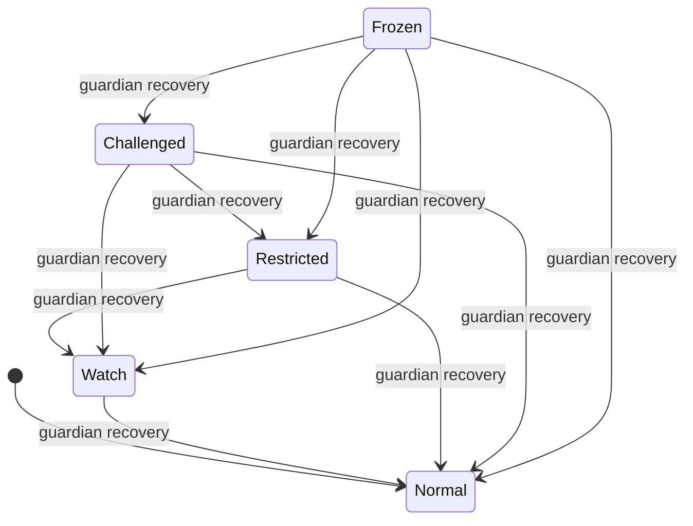

# The Warden Protocol

**Protocol version: 1.0.0** — see [Protocol versioning](#protocol-versioning) below for
what that number means and when it changes. This is independent of any single repo's
release tag (`warden-contract`'s current release is
[v0.3.0](https://github.com/Femology/warden-contract/releases/tag/v0.3.0); the protocol
version and the contract's own version number are not the same thing and will drift).

## What this document is

A specification of Warden's rules, independent of Rust, Soroban, or any single
implementation. Anyone building a compatible oracle, an alternative wallet integration,
or an alternative frontend should be able to build against this document alone —
without reading `warden-contract`'s Rust source. Where this document and the deployed
contract's actual behavior ever disagree, that is a bug in one of the two, not a
license to guess; see [Governance](#governance) for how such a disagreement gets
resolved.

This document describes **what the protocol currently does**. It does not describe
aspirations, in-progress work, or anything gated behind a future phase — those are
named explicitly as not-yet-active where relevant, never presented as if they already
exist.

## Scope

The protocol governs a single question, asked once per transfer attempt: **does this
transfer proceed on the wallet's own ordinary signature alone, or does it require one
additional explicit confirmation?** Everything below exists in service of answering
that question, consistently, for every wallet that adopts it.

The protocol does not: move funds, call other contracts, hold custody of any asset,
support multiple assets per deployment, or grant anyone but a wallet's own owner
control over that wallet's spending configuration. The one disclosed exception is the
admin-managed flagged-address registry (§ [Flagged-address registry](#flagged-address-registry))
and the owner-configured guardian/recovery subsystem (§
[Guardian and recovery subsystem](#guardian-and-recovery-subsystem)), each narrowly
scoped and described in full below.

---

## Data types

Language-neutral field descriptions. `i128` and `u64`/`u32` denote signed/unsigned
fixed-width integers exactly as an implementation would use them on-chain — this
protocol makes no accommodation for floating-point representations of money anywhere,
in any implementation, ever. `Address` denotes a Stellar account or contract address.
Every monetary amount is a fixed-point integer scaled by a single reference asset's
decimals, fixed per deployment at `initialize` time — never a float, at any layer.

### `Policy` (one per wallet)

| Field | Type | Meaning |
|---|---|---|
| `owner` | `Address` | The wallet this policy belongs to. |
| `max_no_stepup` | `i128` | Per-transfer ceiling below which no step-up is required. |
| `daily_velocity_cap` | `i128` | Cumulative ceiling per rolling 24-hour window. |
| `hourly_velocity_cap` | `i128` | Cumulative ceiling per rolling 1-hour window. Must be `<= daily_velocity_cap`. |
| `new_recipient_requires_stepup` | `bool` | Whether an untrusted (or trust-decayed) recipient requires step-up regardless of amount or velocity. |
| `trusted_recipients` | mapping of `Address` → `u64` | Each trusted recipient's `last_paid_at` (ledger timestamp of the most recent transfer to them, or of when they were added if never paid since). |
| `trust_decay_seconds` | `u64` | How long a recipient stays actively trusted without a payment. |
| `updated_at` | `u64` | Ledger timestamp of the last configuration change (**not** touched by a payment refreshing `last_paid_at` — see § [Trust decay](#trust-decay)). |

### `VelocityWindow` (two per wallet: daily and hourly)

| Field | Type | Meaning |
|---|---|---|
| `window_start` | `u64` | Ledger timestamp this window began accumulating from. |
| `cumulative_amount` | `i128` | Total transferred since `window_start`, counting every transfer regardless of decision (§ [Velocity accounting](#velocity-accounting)). |
| `tx_count` | `u32` | Number of transfers counted in this window. |

A wallet with no recorded activity yet reads as a zeroed window (`window_start: 0`,
`cumulative_amount: 0`, `tx_count: 0`) — this is a normal state, not an error.

### `AccountState` (one per wallet)

An enumeration with exactly five values, **ordered least to most restrictive**:

```
Normal < Watch < Restricted < Challenged < Frozen
```

This ordering is itself part of the protocol, not an implementation detail — every
transition rule below is defined in terms of it. A wallet with no `AccountState` ever
explicitly set reads as `Normal`.

### `GuardianConfig` (zero or one per wallet)

| Field | Type | Meaning |
|---|---|---|
| `guardians` | list of `Address`, max 7 | The wallet's configured guardians. |
| `threshold` | `u32` | Approvals required to execute a recovery, `1 <= threshold <= len(guardians)`. |

A wallet that never configured guardians has no `GuardianConfig` at all — this is
distinct from an empty list, and consumers must treat "never configured" and
"configured with zero guardians" (not achievable through the current functions, since
`threshold >= 1` requires at least one guardian) as genuinely different states.

### `RecoveryProposal` (zero or one per wallet, at most one pending at a time)

| Field | Type | Meaning |
|---|---|---|
| `proposer` | `Address` | The guardian who proposed this recovery. |
| `target_state` | `AccountState` | The state this proposal would move the account to if executed. Always strictly less restrictive than the account's state at proposal time. |
| `approvals` | list of `Address` | Guardians who have approved, including the proposer's own automatic approval. |
| `proposed_at` | `u64` | Ledger timestamp the proposal was created. |
| `timelock_seconds` | `u64` | Seconds that must elapse after `proposed_at` before execution is possible. |

### `Decision`

The result of every risk evaluation. Exactly one of:

- `Allow`
- `RequireStepUp(reason)`, where `reason` is one of the `StepUpReason` values below.

### `StepUpReason`

An enumeration with exactly five values as of protocol v1.0.0:

| Value | Meaning |
|---|---|
| `AmountExceeded` | The transfer amount is above `max_no_stepup`. |
| `NewRecipient` | The recipient is not actively trusted (never trusted, or trust decayed — see § [Trust decay](#trust-decay)), and `new_recipient_requires_stepup` is on. |
| `HourlyVelocityExceeded` | This transfer would push the hourly window's cumulative amount over `hourly_velocity_cap`. |
| `VelocityExceeded` | This transfer would push the daily window's cumulative amount over `daily_velocity_cap`. |
| `FlaggedRecipient` | The recipient is present in the flagged-address registry. |

Any new value added to this enumeration is a protocol MINOR version bump at minimum,
and MUST follow the [Governance](#governance) process below before implementation —
this is one of the two changes that process exists specifically to gate.

---

## The evaluation decision

`evaluate(wallet, recipient, amount)` is the one function that answers the protocol's
central question. It runs, in this exact order:

1. **Load the wallet's policy.** If none is configured, the call fails outright — an
   unconfigured wallet gets an explicit failure, never a silent default decision.
2. **Validate the amount.** `amount` must be strictly positive, or the call fails
   outright.
3. **Load or reset both velocity windows.** For each of the hourly (3,600s) and daily
   (86,400s) windows independently: if `now - window_start >= period`, the window
   resets (`window_start = now`, `cumulative_amount = 0`, `tx_count = 0`) before this
   transfer is considered against it.
4. **Determine active trust.** The recipient counts as actively trusted only if present
   in `trusted_recipients` **and** `now - last_paid_at <= trust_decay_seconds`. A
   recipient past that age is still present in the map — decay does not remove an
   entry, only its active-trust status — but no longer satisfies this check. See §
   [Trust decay](#trust-decay).
5. **Decide, checking in this exact order, first match wins:**
   1. Is the recipient present in the flagged-address registry? → `RequireStepUp(FlaggedRecipient)`
   2. Is `new_recipient_requires_stepup` on, and is the recipient **not** actively
      trusted? → `RequireStepUp(NewRecipient)`
   3. Is `amount` greater than `max_no_stepup`? → `RequireStepUp(AmountExceeded)`
   4. Would the hourly window's `cumulative_amount + amount` exceed
      `hourly_velocity_cap`? → `RequireStepUp(HourlyVelocityExceeded)`
   5. Would the daily window's `cumulative_amount + amount` exceed
      `daily_velocity_cap`? → `RequireStepUp(VelocityExceeded)`
   6. Otherwise → `Allow`
6. **Update both velocity windows unconditionally** — `cumulative_amount += amount`,
   `tx_count += 1` — regardless of which decision was reached. See § [Velocity
   accounting](#velocity-accounting).
7. **Refresh trust, if applicable.** If the recipient is present in
   `trusted_recipients` at all (decayed or not — presence is what matters here, not
   active-trust status), its `last_paid_at` is set to `now`. This does **not** modify
   `Policy.updated_at`.
8. **Emit an event and return the decision** — `evaluation_allowed` on `Allow`,
   `stepup_required` on `RequireStepUp`. See § [Event schema](#event-schema).

The check order in step 5 is itself normative: an amount that is both over
`max_no_stepup` and would exceed a velocity cap is always reported as
`AmountExceeded`, never as a velocity reason, regardless of how much velocity headroom
remains. A transfer that would exceed both velocity windows simultaneously is reported
as `HourlyVelocityExceeded`, not `VelocityExceeded` — the more specific, more
immediately actionable signal wins.

Changing this order, or which condition maps to which reason, is the other change the
[Governance](#governance) process exists to gate.

### Velocity accounting

Both windows accumulate every transfer that reaches step 6 above, whether the decision
was `Allow` or `RequireStepUp`. A transfer that required step-up and was then completed
counts exactly the same as one that was allowed outright. This is deliberate: if only
`Allow`-ed transfers counted, a wallet could reset its effective velocity limit simply
by ensuring every transfer triggers step-up first.

Both windows are **fixed, not sliding** — each resets completely once its own period
has elapsed since its own `window_start`, rather than continuously rolling a trailing
total forward. This creates a known, disclosed edge case: a wallet could spend up to a
cap in the moments before a reset and again immediately after, briefly exceeding its
configured limit across that boundary. This applies independently to each window and
is an accepted v1 simplification, not an oversight.

### Trust decay

A recipient becomes actively trusted the moment `add_trusted_recipient` succeeds
(`last_paid_at` set to that moment) and stays actively trusted as long as a transfer to
them occurs at least once every `trust_decay_seconds`. Once that interval is exceeded
without a payment, the recipient reverts to being treated as new for the purposes of
step 5.2 above — without being removed from `trusted_recipients`, and without any
action from the wallet owner. A single subsequent payment to that recipient
re-establishes active trust from that point.

`remove_trusted_recipient` is the only operation that removes an entry from
`trusted_recipients` outright.

---

## Account state diagram and every legal transition



Every arrow above is labeled `guardian recovery` because **as of protocol v1.0.0, that
is the only legal transition mechanism that exists.** Every arrow drawn moves strictly
toward less restriction (never the other direction), enforced at
`propose_recovery` time (§ [Guardian and recovery
subsystem](#guardian-and-recovery-subsystem)). No arrow moves an account toward more
restriction — there is currently no function, anywhere in the protocol, that increases
an account's restriction level. This is a disclosed gap, not an oversight: automatic
escalation (moving a wallet from `Normal` toward `Restricted`/`Frozen` in response to a
detected risk signal) is the subject of a separate, currently inactive phase — see §
[Signed-attestation schema](#signed-attestation-schema-phase-17--not-active) below.

**The non-negotiable invariant, regardless of how escalation is eventually added:**
escalation, if it ever exists, may only ever *increase* restriction. De-escalation
happens **only** through the guardian recovery path described here, or through the
wallet owner's own direct action (there is currently no owner-direct state-change
function either — only the recovery path exists). No future escalation mechanism may
also carry an implicit de-escalation path; that would need to go through this same
governed process as a new, explicit, separately-reviewed rule.

### Legal transition, precisely

A transition from state `S` to state `S'` is legal if and only if:

1. `S' < S` (strictly less restrictive, per the ordering in § [`AccountState`](#accountstate-one-per-wallet)), and
2. It is executed via `execute_recovery` (§ below) with a `RecoveryProposal` whose
   `target_state` is `S'`, whose `approvals` count is `>= GuardianConfig.threshold`,
   and for which `now >= proposed_at + timelock_seconds`.

No other path to changing `AccountState` exists in protocol v1.0.0.

---

## Guardian and recovery subsystem

A wallet owner may name up to 7 guardians who can, collectively and only after a
timelock, move the account back toward less restriction — without the owner's own
signature. This exists specifically to route around a compromised or unavailable owner
key.

### `set_guardians(wallet, guardians, threshold)`

Requires the wallet owner's own authorization. Fails if the account's current state is
worse than `Watch` (i.e. `Restricted`, `Challenged`, or `Frozen`) — guardian
configuration can only change while the account is still trustworthy enough to
configure, which stops an attacker who just compromised a wallet from immediately
naming their own colluding guardian before the owner notices. Fails if `guardians` has
more than 7 entries, or if `threshold` is zero or exceeds the number of guardians.

### `propose_recovery(wallet, proposer, target_state)`

Requires the proposer's own authorization — **not** the wallet owner's. Fails if no
`GuardianConfig` exists, if `proposer` is not one of the configured guardians, if a
proposal is already pending for this wallet, or if `target_state` is not strictly less
restrictive than the account's current state. On success, creates the
`RecoveryProposal`, starts its timelock at the current ledger time, and counts the
proposer's own approval immediately.

### `approve_recovery(wallet, guardian)`

Requires the guardian's own authorization. Fails if no `GuardianConfig` exists, if
`guardian` is not one of the configured guardians, if no proposal is pending, or if
this guardian already approved the current proposal.

### `execute_recovery(wallet)`

**Requires no authorization from any address at all.** This is the entire point of the
subsystem — routing around a key that may be compromised or simply unavailable.
Callable by literally anyone; only the stored proposal state gates it. Fails if no
`GuardianConfig` exists, if no proposal is pending, if `len(approvals) <
GuardianConfig.threshold`, or if `now < proposed_at + timelock_seconds`. On success,
sets `AccountState` to the proposal's `target_state` and clears the proposal.

### `cancel_recovery(wallet)`

Requires the wallet owner's own authorization — the owner's veto, usable at any point
before `execute_recovery` succeeds. Protects against a guardian-majority collusion
attack while the owner's own key is still fine. Fails if no proposal is pending.

### What guardians categorically cannot do

Guardians can change `AccountState` and nothing else. No function described in this
section accepts, reads, or writes anything from `Policy`, `VelocityWindow`, or
`trusted_recipients`. Guardians recover access to normal operation; they never gain
any say over how the wallet is configured to behave once recovered.

---

## Flagged-address registry

A single global (not per-wallet) registry of addresses an admin has flagged. Checked
first, before any other rule, in every `evaluate()` call (§ step 5.1 above) — a
flagged recipient always yields `RequireStepUp(FlaggedRecipient)`, regardless of
amount, trust, or velocity headroom, and without consulting `trusted_recipients` or
either velocity window at all.

### `add_flagged_address(admin, address)` / `remove_flagged_address(admin, address)`

Both require that `admin` be the exact address set once at `initialize` — proving the
caller authorized the call is necessary but not sufficient; the address itself must
also be the privileged one. `add_flagged_address` fails if the address is already
flagged; `remove_flagged_address` fails if it isn't currently flagged.

### What populates this registry

As of protocol v1.0.0: **nothing automatically.** It starts empty and is populated only
by explicit admin action, one address at a time. There is no external sanctions list,
scam-address feed, chain-analytics integration, or any automated data source behind it
— this is infrastructure for a future real feed, not a working integration with one.
If and when a real source is adopted, naming it (and the sync mechanism) is itself a
protocol-relevant change subject to [Governance](#governance) below, since it changes
what can trigger `FlaggedRecipient`.

**This registry, and every consumer of it, is not an AI system.** Flagging is a manual
admin action against a static on-chain list. Nothing in this protocol, or any
implementation of it, should ever be described as AI-driven fraud detection.

---

## Signed-attestation schema (Phase 17 — not active)

**Phase 17 (an oracle layer capable of automatically escalating `AccountState` based on
an external risk signal) is not active. It has been explicitly deferred**, pending a
separate decision on whether Warden would integrate a real third-party risk-scoring
API or build an in-house signal-collection service — a decision with materially
different security implications either way, and one this document does not make on
its own authority.

Because Phase 17 is not active, **there is no signed-attestation schema to specify.**
No oracle, no attestation format, no automatic escalation path exists anywhere in the
current protocol. This section exists so that fact is stated explicitly rather than
left ambiguous by omission — a reader should not have to infer "not built" from this
section's absence.

If Phase 17 is ever activated, its own spec must define, at minimum: the exact
attestation payload and signature scheme, which key(s) are authorized to sign a valid
attestation, how an attestation maps to a specific `AccountState` escalation, and —
per the non-negotiable invariant in § [Account state diagram](#account-state-diagram-and-every-legal-transition)
above — confirmation that the mechanism can only ever escalate, never de-escalate.
That spec would itself be a protocol MAJOR version change (see below) and would go
through the same [Governance](#governance) process as any other rule change, before
implementation.

---

## Event schema

Every event below is emitted by the implementation named, using its authorization
subject as the sole indexed topic (alongside the fixed event-name topic), with the
remaining fields as positional data, in the order listed. **Consumers may rely on this
shape remaining stable within a protocol MAJOR version.** A field being added, removed,
reordered, or retyped is a MAJOR version change; nothing here changes silently.

| Event | Topics | Data (positional) |
|---|---|---|
| `policy_set` | `(wallet)` | `max_no_stepup, daily_velocity_cap, hourly_velocity_cap, new_recipient_requires_stepup, trust_decay_seconds` |
| `recipient_trusted` | `(wallet)` | `recipient` |
| `recipient_untrusted` | `(wallet)` | `recipient` |
| `address_flagged` | `(admin)` | `address` |
| `address_unflagged` | `(admin)` | `address` |
| `guardians_set` | `(wallet)` | `guardians, threshold` |
| `recovery_proposed` | `(wallet)` | `proposer, target_state` |
| `recovery_approved` | `(wallet)` | `guardian, approvals_count` |
| `recovery_executed` | `(wallet)` | `target_state` |
| `recovery_cancelled` | `(wallet)` | `proposer, target_state` |
| `evaluation_allowed` | `(wallet)` | `recipient, amount` |
| `stepup_required` | `(wallet)` | `recipient, amount, reason` |

Every event's own name is also implicitly its own fixed topic (e.g. `policy_set` events
carry the topic `"policy_set"` alongside `wallet`) — omitted from the table above for
brevity, present in every real implementation.

---

## Errors

Every fallible operation fails with exactly one of the following, never a bare string
or an untyped panic message a consumer would have to pattern-match against:

| Code | Name | Meaning |
|---|---|---|
| 1 | `NotInitialized` | No admin has been set — `initialize` was never called. |
| 2 | `AlreadyInitialized` | `initialize` was called more than once. |
| 3 | `PolicyNotFound` | The operation requires a configured `Policy` and none exists. |
| 4 | `InvalidAmount` | `evaluate`'s `amount` was not strictly positive. |
| 5 | `InvalidPolicyParams` | `set_policy`'s parameters violate the invariants in § [`Policy`](#policy-one-per-wallet) (negative `max_no_stepup`, a velocity cap below it, or `hourly_velocity_cap` outside `[0, daily_velocity_cap]`). |
| 6 | `RecipientAlreadyTrusted` | `add_trusted_recipient` called for an already-trusted recipient. |
| 7 | `RecipientNotTrusted` | `remove_trusted_recipient` called for a recipient not currently trusted. |
| 8 | `NotAdmin` | The caller authorized the call, but is not the address stored at `initialize`. |
| 9 | `AddressAlreadyFlagged` | `add_flagged_address` called for an already-flagged address. |
| 10 | `AddressNotFlagged` | `remove_flagged_address` called for an address not currently flagged. |
| 11 | `InvalidGuardianConfig` | `set_guardians`'s parameters violate its invariants (more than 7 guardians, or threshold outside `[1, len(guardians)]`). |
| 12 | `GuardianConfigLocked` | `set_guardians` called while `AccountState` is worse than `Watch`. |
| 13 | `GuardiansNotConfigured` | A guardian/recovery operation was attempted on a wallet with no `GuardianConfig`. |
| 14 | `NotGuardian` | The caller authorized the call, but is not one of the wallet's configured guardians. |
| 15 | `InvalidTargetState` | `propose_recovery`'s `target_state` is not strictly less restrictive than the current state. |
| 16 | `RecoveryAlreadyProposed` | `propose_recovery` called while a proposal is already pending. |
| 17 | `RecoveryNotFound` | An operation requiring a pending `RecoveryProposal` found none. |
| 18 | `AlreadyApproved` | `approve_recovery` called twice by the same guardian for one proposal. |
| 19 | `InsufficientApprovals` | `execute_recovery` called before the approval threshold was met. |
| 20 | `TimelockNotElapsed` | `execute_recovery` called before the timelock elapsed. |

A new error code is an additive, MINOR-version-compatible change **unless** it changes
the meaning of an existing code or represents a new state-transition or step-up
trigger, in which case it also falls under [Governance](#governance) below.

---

## Function reference

Every function a conforming implementation exposes, with its authorization
requirement stated explicitly — this is deliberately part of the protocol, not an
implementation detail, since which address must authorize which call is itself a
security-relevant guarantee.

| Function | Requires authorization from | Notes |
|---|---|---|
| `initialize(admin, reference_asset)` | `admin` | Once only. |
| `set_policy(wallet, max_no_stepup, daily_velocity_cap, new_recipient_requires_stepup, hourly_velocity_cap, trust_decay_seconds)` | `wallet` | Creates or updates; never touches `trusted_recipients`. |
| `add_trusted_recipient(wallet, recipient)` | `wallet` | |
| `remove_trusted_recipient(wallet, recipient)` | `wallet` | |
| `add_flagged_address(admin, address)` | `admin`, and must equal the stored admin | |
| `remove_flagged_address(admin, address)` | `admin`, and must equal the stored admin | |
| `set_guardians(wallet, guardians, threshold)` | `wallet` | Blocked while state worse than `Watch`. |
| `propose_recovery(wallet, proposer, target_state)` | `proposer` | Not the wallet. |
| `approve_recovery(wallet, guardian)` | `guardian` | Not the wallet. |
| `execute_recovery(wallet)` | **nobody** | The one function with no authorization requirement at all. |
| `cancel_recovery(wallet)` | `wallet` | |
| `evaluate(wallet, recipient, amount)` | `wallet` | The core decision function. |
| `get_policy(wallet)` | none (public read) | Fails with `PolicyNotFound` on absence. |
| `get_velocity(wallet)` | none (public read) | Never fails on absence — zeroed window instead. |
| `get_account_state(wallet)` | none (public read) | Never fails on absence — `Normal` instead. |
| `get_guardians(wallet)` | none (public read) | Fails with `GuardiansNotConfigured` on absence. |
| `get_recovery_proposal(wallet)` | none (public read) | Fails with `RecoveryNotFound` on absence. |

---

## Protocol versioning

The protocol version is independent of any implementing repo's release tag. It follows
semantic versioning, applied to the *rules* this document specifies, not to any
particular codebase:

- **MAJOR** — any change that breaks an existing consumer relying on this document as
  written: a changed event shape, a removed or retyped field, a changed authorization
  requirement, a changed decision check order, a changed meaning for an existing
  `StepUpReason` or `AccountState` value, or activating Phase 17 (which introduces an
  entirely new class of state-changing event this version doesn't have).
- **MINOR** — additive, backward-compatible changes: a new `StepUpReason` value, a new
  `AccountState` value, a new event, a new function, a new error code that doesn't
  repurpose an existing one.
- **PATCH** — clarifications, typo fixes, or documentation-only changes that don't
  alter what any implementation actually does.

| Version | Date | Summary |
|---|---|---|
| 1.0.0 | 2026-09-12 | Initial protocol specification. Documents the system as shipped through `warden-contract` v0.3.0: `evaluate()`'s five-reason decision order, dual velocity windows, trust decay, the flagged-address registry, and the guardian/recovery subsystem. Phase 17 (oracle/attestation) explicitly not active. |

See [`CHANGELOG.md`](CHANGELOG.md) for the detailed, entry-by-entry history behind
each version bump.

---

## Governance

**Any change to what triggers a state transition, or to what triggers (or is reported
as) a step-up reason, MUST be proposed as a GitHub issue using the [Protocol Rule
Change template](.github/ISSUE_TEMPLATE/protocol-rule-change.md) before it is
implemented.** This applies regardless of how small the change looks — adding a
`StepUpReason` variant, changing the check order in § [The evaluation
decision](#the-evaluation-decision), adding a new path that can move `AccountState`,
or changing which error code a given failure maps to are all in scope.

This exists for one reason: **so the project stays reviewable by someone who didn't
write it.** A protocol whose rules can change via an ordinary code PR, discoverable
only by diffing Rust source, is not something a third party can safely build against.
Requiring a proposal — what changes, why, what it affects — before implementation
means the rule change is visible and arguable *before* it's a fait accompli in `main`.

The required steps:

1. **Open an issue** using the Protocol Rule Change template, filling in all three
   required fields (what changes, why, what it affects) — see the template itself for
   the exact fields and their required level of detail.
2. **Get it acknowledged** — a maintainer confirms the issue is understood and, if
   accepted, states which protocol version bump it implies (MAJOR or MINOR, per §
   [Protocol versioning](#protocol-versioning) above) before implementation starts.
3. **Implement it**, referencing the issue in the implementing PR.
4. **Update this document** in the same PR — the state diagram, the relevant table,
   the decision order, whichever section the change actually touches. A rule change
   that ships without updating `WARDEN-PROTOCOL.md` in the same PR is incomplete, not
   merely under-documented.
5. **Add a `CHANGELOG.md` entry** recording the new protocol version, dated, with a
   short summary and a link back to the originating issue.

Changes that are *not* subject to this process: bug fixes that make an implementation
match this document more closely (the document is ground truth; conforming to it isn't
a protocol change), refactors with no behavioral difference, and anything explicitly
scoped as implementation detail elsewhere in this document (build tooling, storage
layout choices like `Map` vs `Vec`, TTL bump amounts).
